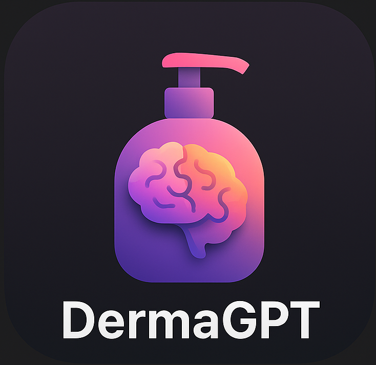
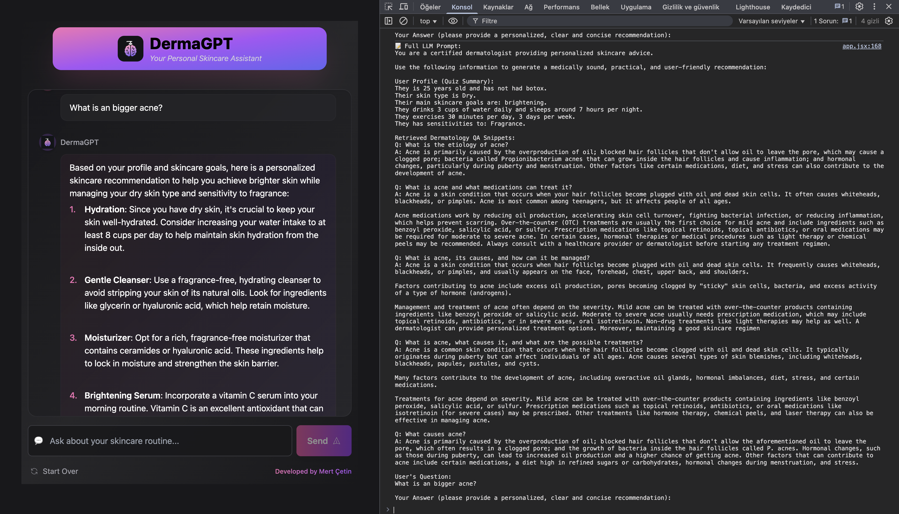

# **DermaGPT 🧠🧴**

# <p align="center"></p>

DermaGPT is an AI-powered personalized skincare advisor that combines computer vision facial analysis with Large Language Models to provide tailored skincare recommendations. This project initially started as a case study but has been extensively customized and expanded to create a comprehensive skincare advisory system.

## 🔍 **Overview**

DermaGPT uses a combination of technologies to analyze user information, facial images, and skincare concerns to provide personalized advice:

1. **🔬 Facial Analysis**: Analyzes uploaded images to detect wrinkles and acne across different facial regions
2. **📋 User Questionnaire**: Collects lifestyle information, skincare goals, and preferences
3. **🔎 RAG (Retrieval Augmented Generation)**: Uses vector search to find relevant skincare information
4. **🧠 Context-Aware LLM**: Provides tailored advice based on all available user data

## ✨ **Features**

-   **👤 Personalized Quiz**: Collect user data including age, skin type, goals, and lifestyle factors
-   **📸 Facial Image Analysis**: Detect and score wrinkle and acne levels across 6 facial regions
-   **💬 Interactive Chat Interface**: Ask questions about skincare concerns and get personalized recommendations
-   **📚 Evidence-Based Advice**: Responses are grounded in dermatological knowledge and best practices
-   **📊 Pinecone Integration**: Efficient vector storage and retrieval for skincare knowledge
-   **🔍 Prompt Transparency**: Access to the full LLM prompts from the console for debugging and understanding response generation, including retrieved QA pairs from Pinecone

## 📷 **Screenshots**

### 📝 Questionnaire Interface


### ❓ Sample Questions


### 💭 Chat Interface


### 📋 Full Prompt Display in the console



## 🏗️ **Architecture**

The system consists of several components:

-   **⚙️ FastAPI Backend**: Handles requests, session management, and coordinates between components
-   **👁️ Face Analysis API**: Processes uploaded images to extract skin condition metrics
-   **🗄️ Vector Database (Pinecone)**: Stores and retrieves relevant skincare knowledge with efficient similarity search
-   **🤖 LLM Integration**: Generates personalized responses using OpenAI's models
-   **🖥️ Frontend Interface**: Provides a user-friendly way to interact with the system

### 📊 **Pinecone Integration**

DermaGPT leverages Pinecone as its vector database for several key benefits:

-   **🔍 Semantic Search**: Enables finding relevant skincare information based on meaning rather than keywords
-   **⚡ Low Latency Queries**: Fast retrieval of relevant information for real-time user interactions
-   **📈 Scalability**: Easily handles growing knowledge bases without performance degradation
-   **🎯 High Precision**: Finds the most relevant skincare information for each specific user query
-   **🔄 Real-time Updates**: Knowledge base can be continuously updated without rebuilding indexes

### 📋 **User Quiz System**

The user questionnaire plays a crucial role in providing personalized recommendations:

-   **💾 Data Collection**: Gathers essential information including age, skin type, concerns, and lifestyle factors
-   **🧮 Profile Building**: Creates a comprehensive user profile for contextualizing recommendations
-   **🎯 Goal Setting**: Defines specific skincare goals to guide the advice provided
-   **🔄 Dynamic Adaptation**: Quiz responses inform the analysis and interpretation of facial analysis results
-   **👥 Personalization**: Quiz data is vectorized and used to retrieve the most relevant skincare knowledge for each user

### 🔍 **Prompt Transparency**

DermaGPT offers full transparency into the AI decision-making process:

-   **📋 Full Prompt Access**: View the complete prompts sent to the LLM, including user context, retrieved knowledge, and instructions
-   **🔧 Debugging Aid**: Helpful for developers to understand how responses are generated and fine-tune the system
-   **📊 Query Analysis**: Examine how user queries are processed and which information is retrieved
-   **🔬 Educational Tool**: Learn about the prompt engineering techniques used in the system

## 🔧 **Technical Details**

The project is built with:

-   **🐍 Python FastAPI**: For the backend REST API
-   **⛓️ LangChain**: For RAG implementation and LLM prompt engineering
-   **🔮 OpenAI API**: For generating personalized responses
-   **👀 Computer Vision APIs**: For facial analysis and feature detection
-   **⚛️ React/Preact**: For the frontend user interface
-   **🌐 Pinecone**: For vector storage and similarity search

## 👨‍💻 **Development**

The project initially began as a case study exploring the potential of combining computer vision with language models for skincare recommendations. Over time, it evolved into a fully-featured application with extensive customizations to enhance user experience and recommendation accuracy.

The project pipeline was developed in the Jupyter notebook `notebooks/derma_pipeline.ipynb`, which demonstrates:

-   Data preprocessing
-   Facial analysis techniques
-   Scoring methodology
-   Prompt engineering
-   Integration with LLMs

## 🚀 **Getting Started**

### 📋 **Prerequisites**

-   Python 3.9+
-   Node.js (for frontend)
-   OpenAI API key
-   Face Analysis API access
-   Pinecone API key

### ⚙️ **Installation**

1. Clone the repository

```bash
git clone https://github.com/merttcetn/DermaGPT.git
cd DermaGPT
```

2. Install backend dependencies

```bash
pip install -r requirements.txt
```

3. Set up environment variables

```bash
# Create a .env file with your API keys
OPENAI_API_KEY=your_openai_key
FACE_ANALYSIS_API_URL=your_face_api_url
PINECONE_API_KEY=your_pinecone_key
PINECONE_ENVIRONMENT=your_pinecone_environment
```

4. Run the backend server

```bash
uvicorn src.main:app --reload
```

5. Start the frontend (in a separate terminal)

```bash
cd frontend-preact
npm install
npm run dev
```

## 🔮 **Future Improvements**

-   📊 Multi-image analysis for tracking skincare progress
-   🛍️ Product recommendation engine
-   🔄 Integration with e-commerce platforms
-   📚 Expanded knowledge base for more specialized skin conditions
-   📱 Mobile application support

## 📜 **License**

This project is licensed under the MIT License - see the LICENSE file for details.

## 🙏 **Acknowledgments**

-   Dermatology resources and research papers
-   OpenAI for LLM capabilities
-   Face analysis API providers for skin condition analysis
-   Pinecone for vector database capabilities
